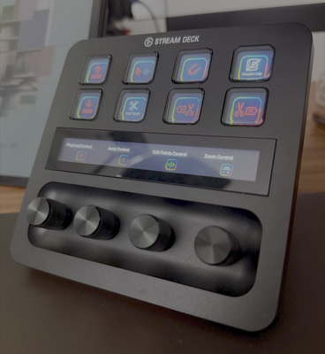

# SpeedEdit for DaVinci — Essential Stream Deck + Plugin

[](https://opensource.org/licenses/MIT)
[](https://www.apple.com/macos/)
[](https://docs.elgato.com/streamdeck/sdk/)
[](https://nodejs.org/)

> Professional Stream Deck + plugin for DaVinci Resolve editors. Transform your Stream Deck into a powerful editing control surface with 4 smart dials and 19 essential buttons.

**⚠️ Currently macOS-only** — Windows support planned for future releases.



## ✨ Features

### 🎛️ **4 Smart Dials (Encoders)**
- **Zoom Control** — Twist to zoom in/out, press to fit timeline
- **Playhead Control** — Spin for frame-perfect scrubbing, press for precision mode  
- **Jump Control** — Turn to hop between cuts, press for edit point selection
- **Edit Point Dial** — Press to cycle edit modes, twist to navigate edit points

### 🔘 **19 Essential Buttons**
- **Playback Controls** — J/L/K workflow, Play/Pause, Play Reverse/Forward
- **Editing Tools** — Cut, Trim Mode Toggle, Delete, Ripple Delete
- **Smart Selection** — Select clips left/right of playhead across all tracks
- **Organization** — Move clips up/down between tracks, Magnetic toggle
- **Advanced** — Ripple Trim Start/End, Disable Clip, Fullscreen Toggle

### ⚡ **Speed Benefits**
- Edit up to **3× faster** with dedicated hardware controls
- Eliminate mouse fatigue and menu diving
- Professional workflow optimization
- Instant access to most-used DaVinci shortcuts

---

## 🚀 Quick Start

### Prerequisites
- **macOS 12+** (Monterey or later)
- **Stream Deck +** device
- **DaVinci Resolve** (any version)
- **Node.js 20+** (for development)

### Installation

1. **Clone the repository:**
   ```bash
   git clone https://github.com/caiosalgado/speededit-davinci.git
   cd speededit-davinci
   ```

2. **Install dependencies:**
   ```bash
   npm install
   ```

3. **Build and install:**
   ```bash
   npm run build
   streamdeck pack com.caio.davinci.sdPlugin
   open SpeedEdit-for-DaVinci-v0.1.0.streamDeckPlugin
   ```

4. **Grant accessibility permissions:**
   - System Settings → Privacy & Security → Accessibility
   - Add Stream Deck app and enable it ✅

---

## 🛠️ Development

### Development Mode
```bash
npm run watch
```
This starts the plugin in development mode with hot reloading.

### Building for Distribution
```bash
npm run build
streamdeck pack com.caio.davinci.sdPlugin
```

### Validation
```bash
streamdeck validate com.caio.davinci.sdPlugin
```

### Project Structure
```
├── src/
│   ├── actions/          # Individual button/dial implementations
│   ├── utils/            # Shared utilities (keyboard, AppleScript)
│   └── plugin.ts         # Main plugin entry point
├── com.caio.davinci.sdPlugin/
│   ├── manifest.json     # Plugin metadata and configuration
│   ├── imgs/             # Icons and images
│   └── bin/              # Compiled JavaScript
└── package.json          # Dependencies and scripts
```

---

## 🎯 Complete Button Reference

### **Playback Controls**
| Button | Shortcut | Function |
|--------|----------|----------|
| Play Pause | `Space` | Start/stop playback |
| Play Forward | `L` | Play forward (multiple presses = faster) |
| Play Reverse | `J` | Play reverse (multiple presses = faster) |

### **Editing Tools**
| Button | Shortcut | Function |
|--------|----------|----------|
| Cut Clip | `Cmd + B` | Razor split at playhead |
| Delete Clip | `Delete` | Remove clip (leaves gap) |
| Ripple Delete | `Shift + Delete` | Remove clip (closes gap) |
| Trim Mode Toggle | `T` / `A` | Switch between Trim and Selection modes |
| Disable Clip | `D` | Enable/disable selected clip |

### **Smart Selection**
| Button | Shortcut | Function |
|--------|----------|----------|
| Select Left | `Option + Cmd + Y` | Select all clips before playhead |
| Select Right | `Option + Y` | Select all clips after playhead |
| Magnetic Toggle | `N` | Toggle timeline snapping |

### **Organization**
| Button | Shortcut | Function |
|--------|----------|----------|
| Move Clip Up | `Option + ↑` | Move clip to track above |
| Move Clip Down | `Option + ↓` | Move clip to track below |

### **Advanced Editing**
| Button | Shortcut | Function |
|--------|----------|----------|
| Ripple Trim Start | `Cmd + Shift + [` | Trim start to playhead |
| Ripple Trim End | `Cmd + Shift + ]` | Trim end to playhead |
| Fullscreen Toggle | `Cmd + F` | Toggle fullscreen mode |

### **Smart Dials (Encoders)**
| Dial | Rotate | Press | Function |
|------|--------|-------|----------|
| Zoom Control | `Cmd + +/-` | `Shift + Z` | Zoom timeline / Fit all |
| Playhead Control | Arrow keys | Toggle mode | Scrub timeline / Precision mode |
| Jump Control | `↑/↓` | `V` | Jump to cuts / Edit point select |
| Edit Points | `Shift + ,/.` | `U` | Navigate edits / Cycle edit modes |

---

## 🔧 Technical Implementation

### **AppleScript Integration**
The plugin uses AppleScript to send keyboard commands to DaVinci Resolve:

```typescript
// Example: Cut clip implementation
await execAsync(`osascript -e 'tell application "DaVinci Resolve" to activate'`);
await new Promise(resolve => setTimeout(resolve, 100));
await execAsync(`osascript -e 'tell application "System Events" to keystroke "b" using command down'`);
```

### **Key Code Usage**
For special keys, we use macOS key codes instead of character strings:
- **Arrow Keys**: Up (126), Down (125), Left (123), Right (124)
- **Special Chars**: Space (49), Delete (51), Brackets (33, 30)

### **Error Handling**
All actions include comprehensive error handling and logging:
```typescript
try {
    streamDeck.logger.info("Action executed");
    // Command execution
} catch (error) {
    streamDeck.logger.error("Error:", error);
}
```

---

## 🤝 Contributing

1. **Fork the repository**
2. **Create a feature branch**
   ```bash
   git checkout -b feature/new-button
   ```
3. **Follow the coding standards**
   - Use TypeScript
   - Include proper error handling
   - Add logging with `streamDeck.logger`
   - Test all functionality
4. **Submit a pull request**

### **Adding New Buttons**
1. Create action file in `src/actions/`
2. Register in `src/plugin.ts`
3. Add to `manifest.json`
4. Add icon in `imgs/actions/buttons/`

---

## 📋 Requirements

### **System Requirements**
- macOS 12.0+ (Monterey)
- Stream Deck + hardware
- DaVinci Resolve (any version)

### **Development Requirements**
- Node.js 20+
- Stream Deck CLI
- TypeScript knowledge

---

## 🐛 Troubleshooting

### **Commands don't work**
1. Verify accessibility permissions for Stream Deck
2. Ensure DaVinci Resolve is the active application
3. Check that shortcuts are set to default in DaVinci

### **Plugin doesn't load**
1. Run `streamdeck validate com.caio.davinci.sdPlugin`
2. Check for compilation errors: `npm run build`
3. Restart Stream Deck application

### **Development Issues**
1. Ensure Node.js 20+ is installed
2. Clear node_modules and reinstall: `rm -rf node_modules && npm install`
3. Check logs in Stream Deck console

---

## 📄 License

This project is licensed under the MIT License - see the [LICENSE](LICENSE) file for details.

---

## 🙏 Acknowledgments

- **Elgato** for the Stream Deck SDK
- **Blackmagic Design** for DaVinci Resolve
- **TypeScript** community for excellent tooling

---

## ⚠️ Disclaimer

*DaVinci Resolve® and Stream Deck® are registered trademarks of their respective owners. This plugin is an independent project and is not affiliated with Blackmagic Design or Elgato.*

---

## 📞 Support

- **Issues**: [GitHub Issues](https://github.com/caiosalgado/speededit-davinci/issues)
- **Discussions**: [GitHub Discussions](https://github.com/caiosalgado/speededit-davinci/discussions)
- **Documentation**: [Stream Deck SDK Docs](https://docs.elgato.com/streamdeck/sdk/)

---

**Made with ❤️ for the DaVinci Resolve editing community** 